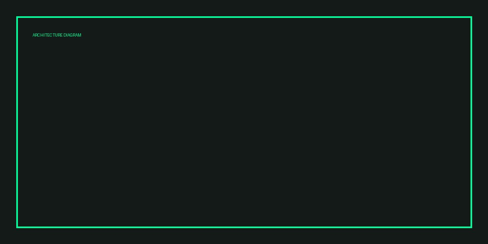

## Heading

```solidity
function withdraw() external { uint x = 1; }
```



Inline `code chip` and a [link](https://example.com).

| col | desc |
| --- | ---- |
| a | b |

- item one
- item two

```ts
const veryLongLine = "aaaaaaaaaaaaaaaaaaaaaaaaaaaaaaaaaaaaaaaaaaaaaaaaaaaaaaaaaaaaaaaaaaaaaaaaaaaaaaaaaaaaaaaaaaaaaaaaaaaaaaaaaaaaa";
```
